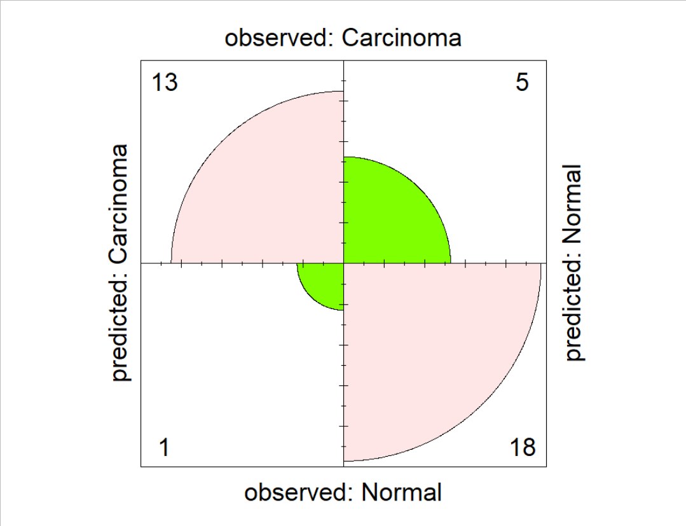

# cancer-sample-identifier

## Introduction
Standard practices in breast cancer diagnosis using magnetic resonance imaging and mammography still obligates the presentation of a tumour.  Incidentally, Chen et al. (2010) (Banin Hirata et al., 2014; Chen et al., 2010) obtained gene expression data from mastectomy patients with ipsilateral breast carcinoma and found aberrant transcriptomic activity in cancerous tissue.  The purpose of this project is to explore the integration of machine learning in malignancy discovery through gene expression analysis: the efficacy of a random forest classifier in differentiating disease and healthy samples is evaluated, given microarray data from established markers for breast cancer, namely ESR1, ERBB2, ESR2, BRCA1, BRCA2, PGR, and TP53 (Hirata et al., 2014).  Future applications of this tool include identification of at-risk individuals using molecular data for closer monitoring.

## Data Exploration and Quality Control
The microarray data was obtained from the GEO dataset GSE10780 submitted my Chen et al.  This dataset was selected because the annotations were particularly amenable to the analysis, whereby the samples were separated in simple groupings, either “Unremarkable breast ducts (Normal)” or “Invasive ductal carcinoma (IDC)”.  It was also attractive because of its size, with 185 in samples total (143 Normal and 42 IDC).  To address the issues of normalization inherent in gene expression data, the authors validated calculated microarray values against the more accurate RT-PCR method for a subset of the samples.

From Figure 1, there appears to be an outlier in each of BRCA1-Normal, ESR2-Carcinoma, and PGR-Carcinoma.  Chen et al. (2010) discuss their judgement in labelling samples from edge cases, such as when histologically normal tissue presented aberrant expression.  In these situations, the authors assigned an IDC label to IDC-like normal tissue if its rank in the upregulation and/or downregulation of different tumour-associated genes, relative to all the other normal tissues, meet a certain threshold.  This may account for the outliers.

If data was found missing for any of the probes while creating the training and validation sets, the associated sample was removed from the analysis because it is more likely that this is an artefact of the use of microarrays in data collection rather than zero expression. 

## Discussion and Conclusion
The model successfully identified the correct type for the majority of the samples (Figure 2).  I ran the analysis a few more times with different training and validation sets and found that this result is consistent.  As discussed in the “Data Exploration and Quality Control” section, errors may be attributed to the fact that IDC and normal tissues are not a true dichotomy (Chen et al., 2010).  Improperly binned samples may belong to these IDC-like normal tissue samples.

It is very possible that global expression of the transcriptome was affected in the carcinoma samples, given that cancer is a complex disease (Hirata et al., 2014). With more time, I would have liked to create a separate random forest model which uses housekeeping genes as features and see whether they are less effective at prediction compared to this classifier.

## Figures

Figure 1. Boxplots showing gene expression values of molecular markers from microarrays of histologically normal and cancerous breast tissue.  This graph was generated in R.
 
 

Figure 2. Fourfold plot visualizing the confusion matrix resulting from the comparison of predicted classification of samples between normal and cancerous breast tissue in the validation set versus the observed classification of the samples. This graph was generated in R.

## Acknowledgements
-	I modified code from the grouped boxplot example in the R graph gallery to generate one of the figures.
-	I modified code from an example script in Prof. Adamowicz’s Fall 2021 BINF*6210 class to create the random forest classifier.
-	I modified code from StackOverflow to create the figure visualizing the confusion matrix.
-	I also consulted StackOverflow and Biostars frequently to debug my code. 
-	I used GeneAnnot to find the Affymetrix probe ID’s of the molecular markers.
-	I am very grateful to my study group (Nykole Crevits, Shalvi Chirmade, and Emily Maier) for their support throughout this project.

## References
Hirata, B. K. B., Oda, J. M. M., Losi Guembarovski, R., Ariza, C. B., Oliveira, C. E. C. D., & Watanabe, M. A. E. (2014). Molecular Markers for Breast Cancer: Prediction on Tumor Behavior. Disease Markers, 2014, 1-12. doi:10.1155/2014/513158

Chen, D.-T., Nasir, A., Culhane, A., Venkataramu, C., Fulp, W., Rubio, R., . . . Yeatman, T. (2010). Proliferative genes dominate malignancy-risk gene signature in histologically-normal breast tissue. Breast Cancer Research and Treatment, 119(2), 335-346. doi:10.1007/s10549-009-0344-y

